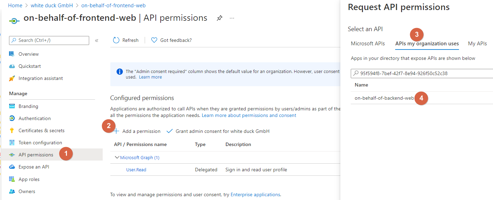
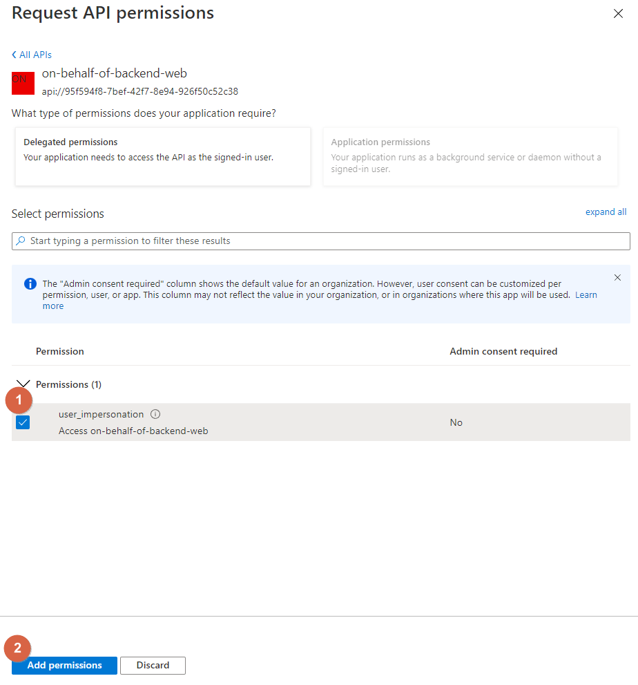
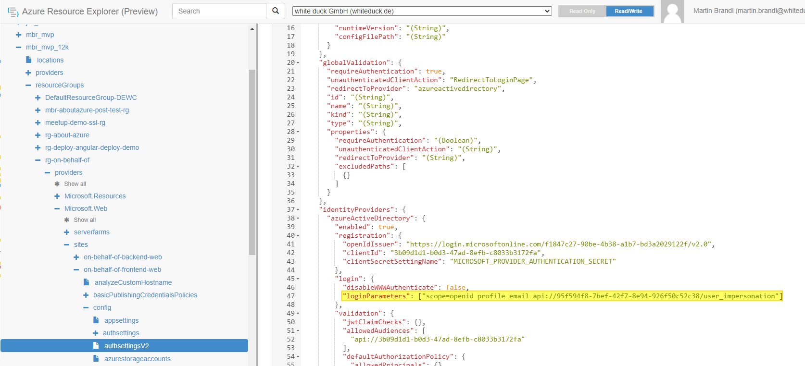

# Description

## Setup the environment

### Resource Group and App Service Plan

```powershell
$rg = 'rg-on-behalf-of'
$location = 'germanywestcentral'
$appServiceplan = 'on-behalf-of-asp'

az group create --name $rg --location $location
az appservice plan create --name $appServicePlan --resource-group $rg --sku S1 --is-linux
```

### Frontend

#### Create Azure Resources for the frontend

```powershell
$frontendApp = 'on-behalf-of-frontend-web'
az webapp create --resource-group $rg --plan $appServiceplan --name $frontendApp --runtime "NODE:14-lts" --startup-file "pm2 serve /home/site/wwwroot --no-daemon --spa"

az webapp config appsettings set --resource-group $rg --name $frontendApp --settings SCM_DO_BUILD_DURING_DEPLOYMENT=FALSE
```

#### Configuration

##### Add Authentication

Within the Azure Web App, Add an identity provider (Web App -> authentication) including the following configuration


This will create an Azure AD application that we will have to edit in the next step.

##### Change Issuer URL

Go back to the Authentication blade and click on Edit:


Here we will have to change the *Issuer URL* from `https://sts.windows.net/<TenantId>/v2.0` to `https://login.microsoftonline.com/<TenantId>/v2.0`:


##### Specify access token version

In the next step, we will have to set the access token version to use the v2 endpoint. This will changes the version and format of the JWT produced independent of the endpoint or client used to request the access token ([Read more](https://docs.microsoft.com/en-us/azure/active-directory/develop/reference-app-manifest#accesstokenacceptedversion-attribute)).

We can quickly jump to the AAD application if we go back to the Authentication blade gain and click on the application name:


Open the Manifest and change the value of `accessTokenAcceptedVersion` from `null` to `2`:


### Backend

#### Create Azure Resources for the backend

```powershell
$backendApp = 'on-behalf-of-backend-web'
az webapp create --resource-group $rg --plan $appServiceplan --name $backendApp --runtime "DOTNET:6.0"
```

#### Configuration

#### Add CORS

In the backend, we have to configure CORS so that our frontend can call it. Under *API*, click on *CORS* and select *Enable Access-Control-Allow-Credentials* and under
*Allowed Origins*, enter the URL from our frontend (you will find the URL of the frontend on the *Overview* page):


##### Add Authentication

We will also add an identity provider (Web App -> authentication) to the backend - just like we did for the frontend, except that we will have to adopt the configuration:


##### Change Issuer URL

Go back to the Authentication blade and click on Edit. Change the Issuer change the *Issuer URL* from `https://sts.windows.net/<TenantId>/v2.0` to `https://login.microsoftonline.com/<TenantId>/v2.0` - like we did for the frontend. 


##### Specify access token version

Just like we did for the frontend Web App, we have to set the access token version to v2. Go to the Authentication blade and click on the application name to jump to the app registration. Open the Manifest and change the value of `accessTokenAcceptedVersion` from `null` to `2`.

##### Add API permissions

On the API permissions page, click on the *+Add a permissions* button under *Configured permissions*. Select Microsoft Graph and add a *Delegated permissions* to `User.ReadWrite.All`. Since the added permissions requires an admin consent, we will also have to click on the *Grant admin consent for <Tenant>* button*


### Extend Frontend configuration

Now, after we have created the backend, we will have to do some changes to our frontend application.

#### API permission

Now that we have created both application, we will have to give the frontend the permission to call the API. Go back to the Azure AD App registration of your frontend and click on API permissions. From there, click on Add a permission and go to the APIs my organization uses tab. There you can enter the Application ID or the name of the backend API:



Now select user_impersonation (allows the application to access the backend on behalf of the signed-in user) and click on the Add permissions button:



#### Configure the frontend Identity Provider to include an access token for the backend

Go to https://resources.azure.com/, at the top of the page, select Read/Write. In the left browser, navigate to subscriptions > <subscription_name > resourceGroups > <resource_group_name> > providers > Microsoft.Web > sites > <app_name> > config > authsettingsV2. Click on Edit and modify the following property:

"identityProviders": {
  "azureActiveDirectory": {
    "login": {
      "loginParameters": ["scope=openid profile email api://95f594f8-7bef-42f7-8e94-926f50c52c38/user_impersonation"]
    }
  }
}



# TODO

The User.Read permission is recommended. This permission is generally required for proper app functionality. It gives access to the sub claim, allowing the app to correctly identify the user over time and access rudimentary user information.

user_impersonation
Allow the application to access on-behalf-of-backend-web-2 on behalf of the signed-in user.